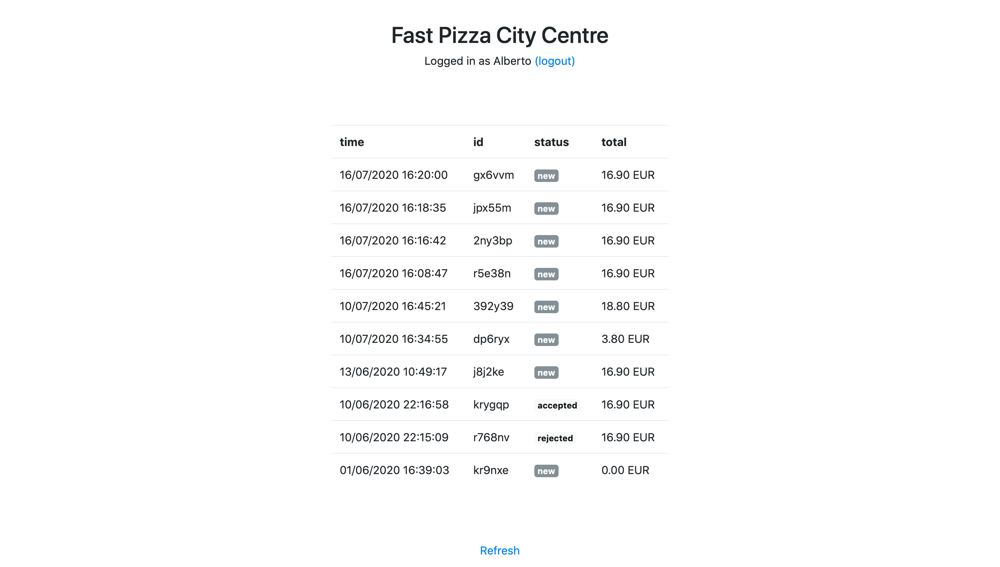

<a href="https://www.hubrise.com/"></a>
<br><br><br>

# HubRise TinyTablet

TinyTablet is an app that prints the orders received by your HubRise location. 

It is a minimalistic browser-based app, that achieves its goal in less than 250 lines of code including the HTML!

You can use this code as a guide when you implement your own solution for HubRise, or you fork this repository and make changes to create your own app. 

## Try the app

First, you need to [create a HubRise account](https://manager.hubrise.com/signup). It's free and it only takes a minute. 

Then, simply [open the app](http://philatist-fish-74534.netlify.com) in your browser. 

You will be asked to connect the app to your HubRise account. 
Granting permissions is a necessary step in every OAuth2.0 authentication process, and requires the user to manually **Allow** the app access. 


You will then see a single-page app that displays the list of the latest orders received by your HubRise location. 
Each line in the logs displays the time, id, status, and total price of the order.



Clicking on one of the logs reveals additional information about the order, such as the customer's details and the purchased products. 


### Sending orders to HubRise (optional)

If you want to send new orders to HubRise, you need a separate app. You can find the detailed steps of how to set up a new app in the [Quick start guide](https://www.hubrise.com/developers/quick-start).

Alternatively, if you want to quickly send an order to HubRise, follow these steps.

1. Copy and paste in your browser the following url: `https://manager.hubrise.com/oauth2/v1/authorize?redirect_uri=urn:ietf:wg:oauth:2.0:oob&client_id=910639589600.clients.hubrise.com&scope=location[orders.write]`
1. **Allow** the app to access your location.
1. Copy the authorisation code. 
1. Substitute your authorisation code and send the following request from the command line:
   ```
   curl -X POST 'https://manager.hubrise.com/oauth2/v1/token?code=YOUR_AUTHORISATION_CODE&client_id=910639589600.clients.hubrise.com&client_secret=15336ea38512c92bab50e519ee29818875430301a9f21adb0525b3d01944648f'
   ```
1. You should obtain a JSON object that looks like this:
   ```
   {"access_token":"qwerty1234567890","account_id":"wbv7z","location_id":"wbv7z-0","catalog_id":"wj9rj","customer_list_id":"wx77p"}
   ```
   Copy the access token.
1. Substitute your access token, replace `EUR` with your location's currency if needed, and send the following request from the command line:
   ```
   curl -H 'X-Access-Token: YOUR_ACCESS_TOKEN' \
   -H 'Content-Type: application/json' \
   -X POST 'https://api.hubrise.com/v1/location/orders' \
   -d '{
     "status": "new",
     "customer": {
       "first_name": "Julie",
       "last_name": "Brown"
     },
     "items": [
       {
         "product_name": "Pizza"
         "quantity": "1",
         "price": "11.90 EUR",
       }
     ]
   }'
   ```
1. Click "Refresh" on the TinyTablet page and you should see the new order.

## What this app is NOT

This app is not production ready! 
Consider it some boilerplate code that you can buil upon to create your own app.
It is also useful to show some of the things you should _not_ do in your app! 

For example, in the first line of the `js/app.js` file, you will find the client secret. 
This is bad coding practice. 

Also, the user interface is too crude to be used in a real case scenario. 

## Running TinyTablet locally

TinyTablet is a Web app with no server code. To run it locally, you just need a static file server.

If you have [Node.js](https://nodejs.org/en/download/) installed on your machine, you can use `serve` for this purpose.

From the project's folder, run:
```
sudo npm install -g serve
serve
```

Then open your browser and navigate to `http://localhost:5000`.

## Additional resources

The HubRise documentation provides additional information to connect your app to HubRise.

You can try our [Quick start guide](https://www.hubrise.com/developers/quick-start), or see our [API reference](https://www.hubrise.com/developers/api/general-concepts) for more details about the HubRise API.

## Contact

If you need help or want to integrate your solution with HubRise, contact us at <support@hubrise.com>.

## License

This app and the relative code are released under the MIT License.
